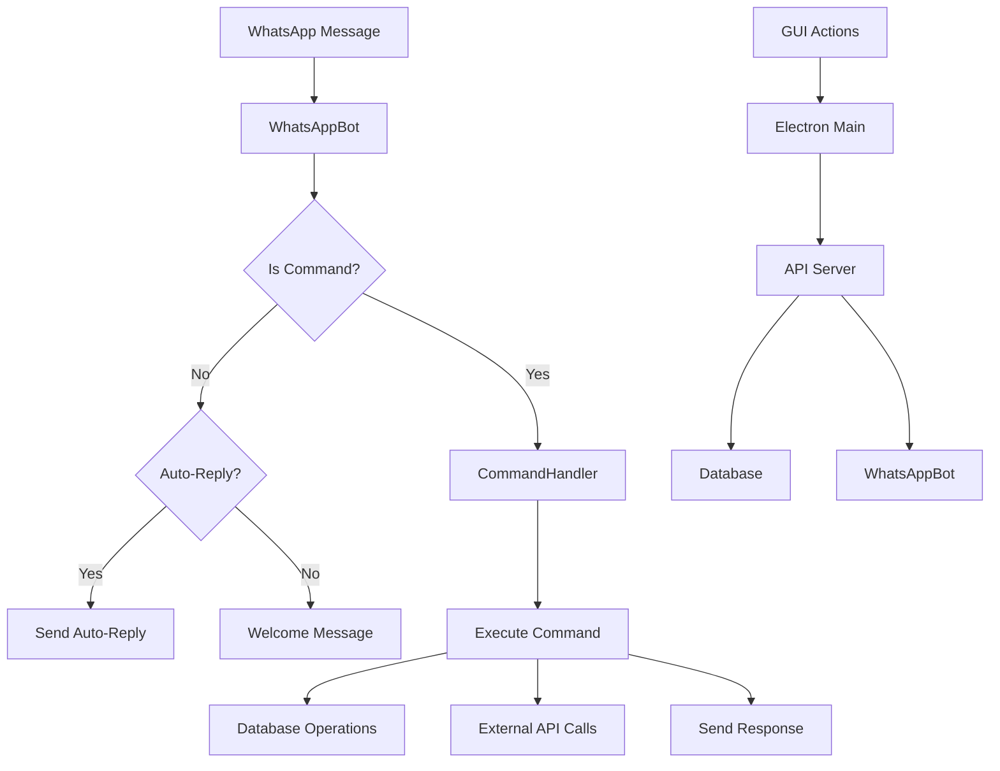

# 🔧 Developer Guide

Welcome to the **WhatsBotX Developer Guide**. This comprehensive guide is designed for developers who want to contribute to, extend, or customize WhatsBotX.

## 📋 Table of Contents

- [Development Setup](#-development-setup)
- [Project Architecture](#-project-architecture)
- [Code Standards](#-code-standards)
- [Testing](#-testing)
- [API Development](#-api-development)
- [Plugin Development](#-plugin-development)
- [Database Schema](#-database-schema)
- [Deployment](#-deployment)

---

## 🚀 Development Setup

### Prerequisites

- **Node.js 18+** - [Download here](https://nodejs.org/)
- **Git** - Version control
- **VS Code** (recommended) - With extensions:
  - ESLint
  - Prettier
  - Jest
  - GitLens

### Local Development

```bash
# Clone repository
git clone https://github.com/yourusername/WhatsBotX.git
cd WhatsBotX

# Install dependencies
npm install

# Copy environment file
cp .env.example .env

# Start development server
npm run dev

# Run tests
npm test

# Build for production
npm run build
```

### Development Scripts

```json
{
  "scripts": {
    "dev": "nodemon src/index.js",
    "start": "node src/index.js",
    "build": "webpack --mode production",
    "test": "jest",
    "test:watch": "jest --watch",
    "test:coverage": "jest --coverage",
    "lint": "eslint src/**/*.js",
    "lint:fix": "eslint src/**/*.js --fix",
    "format": "prettier --write src/**/*.js"
  }
}
```

---

## 🏗️ Project Architecture

### Directory Structure

```
WhatsBotX/
├── 📁 src/
│   ├── 📄 index.js                 # Application entry point
│   ├── 📁 bot/
│   │   └── 📄 WhatsAppBot.js       # WhatsApp Web integration
│   ├── 📁 commands/
│   │   └── 📄 CommandHandler.js    # Command processing logic
│   ├── 📁 database/
│   │   └── 📄 Database.js          # SQLite database operations
│   ├── 📁 electron/
│   │   ├── 📄 main.cjs            # Electron main process
│   │   └── 📁 renderer/
│   │       ├── 📄 index.html      # GUI interface
│   │       ├── 📄 app.js          # Frontend logic
│   │       └── 📄 styles.css      # UI styling
│   ├── 📁 api/
│   │   └── 📄 ApiServer.js        # REST API server
│   ├── 📁 services/
│   │   ├── 📄 ScheduleManager.js  # Reminder scheduling
│   │   └── 📄 Logger.js           # Logging utilities
│   └── 📁 utils/
│       └── 📄 helpers.js          # Utility functions
├── 📁 tests/
│   ├── 📁 unit/
│   ├── 📁 integration/
│   └── 📁 e2e/
├── 📁 docs/
│   ├── 📄 README.md
│   ├── 📄 API.md
│   └── 📄 USER_MANUAL.md
├── 📁 scripts/
│   ├── 📄 build.js
│   └── 📄 deploy.js
├── 📄 package.json
├── 📄 .env.example
└── 📄 .eslintrc.js
```

### Component Overview

#### Core Components

**WhatsAppBot (`src/bot/WhatsAppBot.js`)**
- Handles WhatsApp Web connection
- Manages QR code authentication
- Processes incoming messages
- Sends outgoing messages

**CommandHandler (`src/commands/CommandHandler.js`)**
- Parses incoming commands
- Executes command logic
- Manages command state
- Handles auto-replies

**Database (`src/database/Database.js`)**
- SQLite database operations
- User management
- Message history storage
- Settings persistence

**ApiServer (`src/api/ApiServer.js`)**
- REST API endpoints
- Request validation
- Response formatting
- Rate limiting

#### Service Layer

**ScheduleManager (`src/services/ScheduleManager.js`)**
- Cron job scheduling
- Reminder management
- Time-based task execution

**Logger (`src/services/Logger.js`)**
- Structured logging
- Log level management
- File and console output

### Data Flow



---

## 📏 Code Standards

### JavaScript Standards

**ES6+ Features**
```javascript
// ✅ Use arrow functions
const processMessage = async (message) => {
  // processing logic
};

// ✅ Use async/await
const result = await database.query(sql);

// ✅ Use destructuring
const { id, name } = user;

// ✅ Use template literals
const message = `Hello ${name}!`;
```

**Error Handling**
```javascript
// ✅ Proper error handling
try {
  const result = await riskyOperation();
  return result;
} catch (error) {
  logger.error('Operation failed:', error);
  throw new Error('Operation failed');
}

// ❌ Avoid empty catch blocks
try {
  // code
} catch (error) {
  // Don't ignore errors
}
```

### Naming Conventions

**Files and Classes**
```javascript
// PascalCase for classes
class WhatsAppBot { }

// camelCase for files
// whatsAppBot.js

// kebab-case for directories
// command-handler/
```

**Variables and Functions**
```javascript
// camelCase for variables and functions
const userId = 123;
function processMessage() { }

// UPPER_CASE for constants
const MAX_RETRIES = 3;
const API_BASE_URL = 'http://localhost:3000';

// PascalCase for constructors
class DatabaseConnection { }
```

### Documentation Standards

**JSDoc Comments**
```javascript
/**
 * Processes incoming WhatsApp messages
 * @param {string} message - The incoming message text
 * @param {Object} user - User information object
 * @param {number} user.id - User ID
 * @param {string} user.phone - User phone number
 * @returns {Promise<string|null>} Response message or null
 * @throws {Error} When message processing fails
 */
async function processMessage(message, user) {
  // implementation
}
```

**Inline Comments**
```javascript
// ✅ Good comments explain why, not what
// Check if user has admin privileges
if (user.role === 'admin') {
  // Allow access to admin features
}

// ❌ Avoid obvious comments
// Set user name
user.name = 'John';
```

---

## 🧪 Testing

### Testing Framework

WhatsBotX uses **Jest** for testing with the following setup:

```javascript
// jest.config.js
module.exports = {
  testEnvironment: 'node',
  collectCoverageFrom: [
    'src/**/*.js',
    '!src/index.js'
  ],
  coverageThreshold: {
    global: {
      branches: 80,
      functions: 80,
      lines: 80,
      statements: 80
    }
  }
};
```

### Unit Testing

**Example Test File**
```javascript
// tests/unit/CommandHandler.test.js
import CommandHandler from '../../src/commands/CommandHandler.js';

describe('CommandHandler', () => {
  let handler;
  let mockDatabase;

  beforeEach(() => {
    mockDatabase = {
      saveChatHistory: jest.fn(),
      getUserById: jest.fn()
    };
    handler = new CommandHandler(mockDatabase);
  });

  describe('processMessage', () => {
    test('should return null for non-commands', async () => {
      const result = await handler.processMessage('Hello world', {});
      expect(result).toBeNull();
    });

    test('should process valid commands', async () => {
      mockDatabase.saveChatHistory.mockResolvedValue();
      mockDatabase.getUserById.mockResolvedValue({ id: 1 });

      const result = await handler.processMessage('/ping', { id: 1 });
      expect(result).toContain('Pong');
    });

    test('should handle unknown commands', async () => {
      const result = await handler.processMessage('/unknown', { id: 1 });
      expect(result).toContain('Unknown command');
    });
  });
});
```

### Integration Testing

**API Integration Test**
```javascript
// tests/integration/ApiServer.test.js
import request from 'supertest';
import ApiServer from '../../src/api/ApiServer.js';

describe('ApiServer', () => {
  let server;
  let app;

  beforeAll(async () => {
    server = new ApiServer();
    app = server.app;
    await server.start();
  });

  afterAll(async () => {
    await server.stop();
  });

  describe('POST /api/v1/send-message', () => {
    test('should send message successfully', async () => {
      const response = await request(app)
        .post('/api/v1/send-message')
        .send({
          number: '+1234567890',
          message: 'Test message'
        })
        .expect(200);

      expect(response.body.success).toBe(true);
    });

    test('should validate input', async () => {
      const response = await request(app)
        .post('/api/v1/send-message')
        .send({})
        .expect(400);

      expect(response.body.error).toContain('validation');
    });
  });
});
```

### E2E Testing

**End-to-End Test**
```javascript
// tests/e2e/whatsapp-integration.test.js
import WhatsAppBot from '../../src/bot/WhatsAppBot.js';

describe('WhatsApp Integration', () => {
  let bot;

  beforeAll(async () => {
    bot = new WhatsAppBot(mockDatabase, mockCommandHandler);
    await bot.initialize();
  }, 30000); // 30 second timeout

  afterAll(async () => {
    await bot.stop();
  });

  test('should connect to WhatsApp', async () => {
    // Wait for connection
    await new Promise(resolve => {
      bot.once('connectionStatus', (status) => {
        if (status === 'connected') resolve();
      });
    });

    expect(bot.isConnected).toBe(true);
  });

  test('should send and receive messages', async () => {
    const testMessage = 'Test message';
    const result = await bot.sendMessage('+1234567890', testMessage);

    expect(result).toBe(true);
  });
});
```

### Running Tests

```bash
# Run all tests
npm test

# Run with coverage
npm run test:coverage

# Run specific test file
npm test CommandHandler.test.js

# Run tests in watch mode
npm run test:watch

# Run integration tests only
npm test -- --testPathPattern=integration
```

---

## 🔌 API Development

### REST API Structure

**Base URL:** `http://localhost:3000/api/v1`

**Authentication:** API Key in headers
```javascript
headers: {
  'Authorization': 'Bearer YOUR_API_KEY',
  'Content-Type': 'application/json'
}
```

### Endpoint Development

**Creating New Endpoints**
```javascript
// src/api/ApiServer.js
class ApiServer {
  constructor() {
    this.app = express();
    this.setupRoutes();
  }

  setupRoutes() {
    // Health check
    this.app.get('/health', (req, res) => {
      res.json({ status: 'ok', timestamp: new Date() });
    });

    // Send message endpoint
    this.app.post('/api/v1/send-message', this.authenticate, async (req, res) => {
      try {
        const { number, message } = req.body;

        // Validation
        if (!number || !message) {
          return res.status(400).json({
            error: 'Missing required fields: number, message'
          });
        }

        // Send message logic
        const result = await this.whatsAppBot.sendMessage(number, message);

        res.json({
          success: result,
          number,
          timestamp: new Date()
        });
      } catch (error) {
        logger.error('Send message error:', error);
        res.status(500).json({ error: 'Internal server error' });
      }
    });
  }

  authenticate(req, res, next) {
    const apiKey = req.headers.authorization?.replace('Bearer ', '');

    if (!apiKey || apiKey !== process.env.API_KEY) {
      return res.status(401).json({ error: 'Invalid API key' });
    }

    next();
  }
}
```

### Rate Limiting

```javascript
// Rate limiting middleware
const rateLimit = require('express-rate-limit');

const apiLimiter = rateLimit({
  windowMs: 15 * 60 * 1000, // 15 minutes
  max: 100, // limit each IP to 100 requests per windowMs
  message: 'Too many requests from this IP, please try again later.',
  standardHeaders: true,
  legacyHeaders: false,
});

app.use('/api/', apiLimiter);
```

### Input Validation

```javascript
// Validation middleware
const validateSendMessage = (req, res, next) => {
  const { number, message } = req.body;

  // Phone number validation
  const phoneRegex = /^\+\d{10,15}$/;
  if (!phoneRegex.test(number)) {
    return res.status(400).json({
      error: 'Invalid phone number format. Use international format: +1234567890'
    });
  }

  // Message validation
  if (!message || message.length > 4096) {
    return res.status(400).json({
      error: 'Message must be 1-4096 characters long'
    });
  }

  next();
};

app.post('/api/v1/send-message', validateSendMessage, async (req, res) => {
  // handler logic
});
```

---

## 🔌 Plugin Development

### Plugin Architecture

**Plugin Interface**
```javascript
// plugins/example-plugin.js
class ExamplePlugin {
  constructor(bot, database) {
    this.bot = bot;
    this.database = database;
    this.name = 'example-plugin';
    this.version = '1.0.0';
  }

  // Plugin lifecycle methods
  async initialize() {
    logger.info(`Initializing ${this.name} plugin`);
    // Setup plugin resources
  }

  async destroy() {
    logger.info(`Destroying ${this.name} plugin`);
    // Cleanup resources
  }

  // Plugin commands
  getCommands() {
    return {
      '/example': {
        description: 'Example plugin command',
        handler: this.handleExample.bind(this)
      }
    };
  }

  async handleExample(args, user) {
    return `Example plugin response: ${args.join(' ')}`;
  }

  // Event handlers
  onMessage(message, user) {
    // Handle incoming messages
  }

  onCommand(command, args, user) {
    // Handle specific commands
  }
}

export default ExamplePlugin;
```

### Plugin Loader

```javascript
// src/plugins/PluginManager.js
class PluginManager {
  constructor() {
    this.plugins = new Map();
  }

  async loadPlugin(pluginPath) {
    try {
      const PluginClass = (await import(pluginPath)).default;
      const plugin = new PluginClass(this.bot, this.database);

      await plugin.initialize();
      this.plugins.set(plugin.name, plugin);

      // Register plugin commands
      const commands = plugin.getCommands();
      for (const [command, handler] of Object.entries(commands)) {
        this.commandHandler.registerCommand(command, handler);
      }

      logger.success(`Loaded plugin: ${plugin.name} v${plugin.version}`);
    } catch (error) {
      logger.error(`Failed to load plugin ${pluginPath}:`, error);
    }
  }

  async unloadPlugin(pluginName) {
    const plugin = this.plugins.get(pluginName);
    if (plugin) {
      await plugin.destroy();
      this.plugins.delete(pluginName);
      logger.info(`Unloaded plugin: ${pluginName}`);
    }
  }

  broadcastEvent(event, ...args) {
    for (const plugin of this.plugins.values()) {
      if (typeof plugin[event] === 'function') {
        plugin[event](...args);
      }
    }
  }
}
```

### Plugin Configuration

```json
// plugin-config.json
{
  "plugins": {
    "enabled": ["example-plugin", "analytics-plugin"],
    "disabled": ["experimental-plugin"],
    "config": {
      "example-plugin": {
        "apiKey": "your-api-key",
        "debug": true
      }
    }
  }
}
```

---

## 💾 Database Schema

### SQLite Tables

**users table**
```sql
CREATE TABLE users (
  id INTEGER PRIMARY KEY AUTOINCREMENT,
  phone_number TEXT UNIQUE NOT NULL,
  name TEXT,
  language TEXT DEFAULT 'en',
  timezone TEXT DEFAULT 'UTC',
  created_at DATETIME DEFAULT CURRENT_TIMESTAMP,
  updated_at DATETIME DEFAULT CURRENT_TIMESTAMP
);
```

**chat_history table**
```sql
CREATE TABLE chat_history (
  id INTEGER PRIMARY KEY AUTOINCREMENT,
  user_id INTEGER NOT NULL,
  message TEXT NOT NULL,
  response TEXT,
  command TEXT,
  created_at DATETIME DEFAULT CURRENT_TIMESTAMP,
  FOREIGN KEY (user_id) REFERENCES users(id)
);
```

**todos table**
```sql
CREATE TABLE todos (
  id INTEGER PRIMARY KEY AUTOINCREMENT,
  user_id INTEGER NOT NULL,
  task TEXT NOT NULL,
  completed BOOLEAN DEFAULT FALSE,
  priority TEXT DEFAULT 'medium',
  due_date DATETIME,
  created_at DATETIME DEFAULT CURRENT_TIMESTAMP,
  updated_at DATETIME DEFAULT CURRENT_TIMESTAMP,
  FOREIGN KEY (user_id) REFERENCES users(id)
);
```

**reminders table**
```sql
CREATE TABLE reminders (
  id INTEGER PRIMARY KEY AUTOINCREMENT,
  user_id INTEGER NOT NULL,
  message TEXT NOT NULL,
  remind_at DATETIME NOT NULL,
  sent BOOLEAN DEFAULT FALSE,
  created_at DATETIME DEFAULT CURRENT_TIMESTAMP,
  FOREIGN KEY (user_id) REFERENCES users(id)
);
```

**settings table**
```sql
CREATE TABLE settings (
  id INTEGER PRIMARY KEY AUTOINCREMENT,
  user_id INTEGER,
  key TEXT NOT NULL,
  value TEXT,
  created_at DATETIME DEFAULT CURRENT_TIMESTAMP,
  FOREIGN KEY (user_id) REFERENCES users(id),
  UNIQUE(user_id, key)
);
```

### Database Operations

**User Management**
```javascript
// Create user
await db.run(
  'INSERT INTO users (phone_number, name) VALUES (?, ?)',
  [phoneNumber, name]
);

// Get user by phone
const user = await db.get(
  'SELECT * FROM users WHERE phone_number = ?',
  [phoneNumber]
);
```

**Migration System**
```javascript
// migrations/001_initial_schema.js
export async function up(db) {
  await db.exec(`
    CREATE TABLE users (
      id INTEGER PRIMARY KEY AUTOINCREMENT,
      phone_number TEXT UNIQUE NOT NULL,
      name TEXT,
      created_at DATETIME DEFAULT CURRENT_TIMESTAMP
    );
  `);
}

export async function down(db) {
  await db.exec('DROP TABLE users;');
}
```

---

## 🚀 Deployment

### Production Build

```bash
# Create production build
npm run build

# Create executable
npm run dist

# The built application will be in dist/ directory
```

### Docker Deployment

**Dockerfile**
```dockerfile
FROM node:18-alpine

# Install dependencies for puppeteer
RUN apk add --no-cache \
    chromium \
    nss \
    freetype \
    freetype-dev \
    harfbuzz \
    ca-certificates \
    ttf-freefont

# Create app directory
WORKDIR /app

# Copy package files
COPY package*.json ./

# Install dependencies
RUN npm ci --only=production

# Copy source code
COPY . .

# Create non-root user
RUN addgroup -g 1001 -S nodejs
RUN adduser -S whatsbotx -u 1001

# Change ownership
RUN chown -R whatsbotx:nodejs /app
USER whatsbotx

# Expose port
EXPOSE 3000

# Set puppeteer to use installed chromium
ENV PUPPETEER_SKIP_CHROMIUM_DOWNLOAD=true \
    PUPPETEER_EXECUTABLE_PATH=/usr/bin/chromium-browser

# Start application
CMD ["npm", "start"]
```

**docker-compose.yml**
```yaml
version: '3.8'
services:
  whatsbotx:
    build: .
    ports:
      - "3000:3000"
    volumes:
      - ./data:/app/data
      - ./logs:/app/logs
    environment:
      - NODE_ENV=production
      - API_PORT=3000
    restart: unless-stopped
```

### Environment Configuration

**Production .env**
```env
# Application
NODE_ENV=production
PORT=3000

# Database
DB_PATH=./data/whatsbotx.db

# WhatsApp
SESSION_PATH=./data/sessions

# API
API_KEY=your-secure-api-key-here

# Logging
LOG_LEVEL=info
LOG_FILE=./logs/whatsbotx.log

# Security
RATE_LIMIT_WINDOW=900000
RATE_LIMIT_MAX=100

# External APIs
OPENAI_API_KEY=your-openai-key
WEATHER_API_KEY=your-weather-key
NEWS_API_KEY=your-news-key
```

### Process Management

**PM2 Configuration**
```javascript
// ecosystem.config.js
module.exports = {
  apps: [{
    name: 'whatsbotx',
    script: 'src/index.js',
    instances: 1,
    autorestart: true,
    watch: false,
    max_memory_restart: '1G',
    env: {
      NODE_ENV: 'production',
      PORT: 3000
    },
    error_file: './logs/pm2-error.log',
    out_file: './logs/pm2-out.log',
    log_file: './logs/pm2-combined.log',
    time: true
  }]
};
```

### Monitoring and Logging

**Health Checks**
```bash
# Application health
curl http://localhost:3000/health

# Database health
curl http://localhost:3000/api/v1/health/db

# WhatsApp connection
curl http://localhost:3000/api/v1/status
```

**Log Rotation**
```bash
# Install logrotate
sudo apt install logrotate

# Create logrotate config
sudo nano /etc/logrotate.d/whatsbotx
```

```
/var/log/whatsbotx/*.log {
    daily
    missingok
    rotate 52
    compress
    delaycompress
    notifempty
    create 644 whatsbotx whatsbotx
    postrotate
        pm2 reloadLogs
    endscript
}
```

---

## 🤝 Contributing

### Development Workflow

1. **Fork the repository**
2. **Create a feature branch**
   ```bash
   git checkout -b feature/your-feature-name
   ```
3. **Make your changes**
4. **Write tests** for new functionality
5. **Run the test suite**
   ```bash
   npm test
   ```
6. **Update documentation** if needed
7. **Commit your changes**
   ```bash
   git commit -m "Add: Your feature description"
   ```
8. **Push to your fork**
   ```bash
   git push origin feature/your-feature-name
   ```
9. **Create a Pull Request**

### Code Review Process

- All PRs require review from at least one maintainer
- Tests must pass CI/CD pipeline
- Code must follow established standards
- Documentation must be updated
- Breaking changes require discussion

### Commit Message Format

```
type(scope): description

[optional body]

[optional footer]
```

**Types:**
- `feat`: New feature
- `fix`: Bug fix
- `docs`: Documentation
- `style`: Code style changes
- `refactor`: Code refactoring
- `test`: Testing
- `chore`: Maintenance

**Examples:**
```
feat(auth): add API key authentication
fix(api): handle null response in weather endpoint
docs(readme): update installation instructions
test(commands): add unit tests for todo commands
```

---

<div align="center">

**📖 [Back to README](README.md) • 🧪 [Testing](TESTING.md) • 🔌 [API Reference](API.md)**

---

*Developer Guide v2.1.0 - Last updated: January 24, 2024*

</div>
